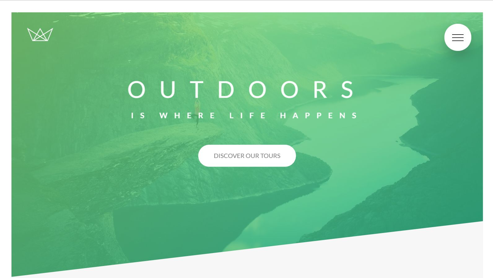
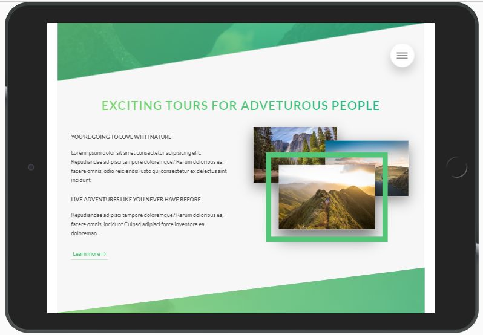

# NATOURS
## outdoor is where life happens!

**If you want to try it out, click here: [Natours webpage](https://ulakrawczyk.github.io/Natours/)**

### This is a webpage created during the Udemy course of advanced techniques in CSS:
* html 5
* css 3
* gulp (based on starter kit)
* npm packages

### Page is fully responsive even the images:

