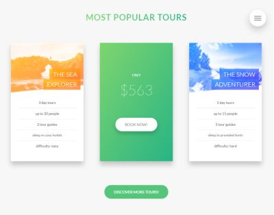

# NATOURS 
## a webpage for adventurous people!

**If you want to try it out, click here: [Natours webpage](https://ulakrawczyk.github.io/Natours/)**

### This is a webpage created during the Udemy course of advanced techniques in CSS:
* creating the shape of containers
* adding gradient to text 
* rotating cards
* popup using only css
* hamburger menu using only css
* form with custom radio buttons
* bacground video

### Page is fully responsive using:
* media queries and correct units
* responsive images with resolution and density switching, art direction
* desktop first technique

#### Browser support was also considered (graceful degradation used).

#### To run my project locally, you need:

`npm install -g gulp-cli`

`npm install`

`gulp`
